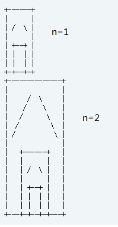

# 模拟
## 简述
    事实上模拟题很少会用到算法，模拟题考验的是我们的代码实现能力，简单的模拟题基本不用想，就是水题，但是比较难的模拟题，需要我们仔细思考，要寻找出一种能够在代码上相对来说比较好实现并且可以解决这道题的数据结构，这考验的是我们对数据结构的掌握和对题意向代码的转化。模拟题很耗时，比赛中一般会在2~3小时的时候开始做模拟题，耗时大概30~100分钟不等，只要静下心，考虑到题中的所有坑点，一般模拟题都可以AC。在这里给大家推荐几道我做过的不错的模拟题。

## 解题技巧
- 模拟的题型，基本难度不大，关键读懂题意。
- 赛场上不要着急于去快速的解决模拟题，因为这类题，一般做起来比较耗时。
- 想做好模拟题，需要有活跃的思维和对数据结构等知识的扎实的掌握，基础很重要！
- 有一些模拟题是可以通过刷题来锻炼出来解题能力的，不过太难的模拟题不推荐大家浪费太多时间在上面。
- 有一些模拟题，看似没有什么算法，很简单，但是会卡时间，需要大家想一下如何优化，所以大家不要盲目的去解决模拟题。

## 例题
### 例题1 poj 1068
**题意**：对于给出的原括号串，存在两种数字密码串：
1.p序列：当出现匹配括号对时，从该括号对的右括号开始往左数，直到最前面的左括号数，就是pi的值。
2.w序列：当出现匹配括号对时，包含在该括号对中的所有右括号数（包括该括号对）,就是wi的值。
对给出的p数字串，求出对应的s串。串长限制均为20。
**要求**：Time Limit: 1000 MS , Memory Limit: 10000 K
**思路**：清楚了题意后，这道题并不是很难，直接模拟就行了，在小优的博客上学到了一个小技巧，和大家分享一下：在处理括号序列时可以把括号序列转化为01序列，左0右1，处理时比较方便
**参考出处**：http://user.qzone.qq.com/289065406/blog/1299127551

```cpp
#include<iostream>
#include<cstring>
using namespace std;

int main(void)
{
    int p[21]={0};
    int w[20];
    int str[40];
    int n;

    int cases;
    cin>>cases;
    while(cases--)
    {
        memset(str,0,sizeof(str));
        cin>>n;
        int i,j,k;
        for(i=1;i<=n;i++)
            cin>>p[i];
        for(j=0,i=1;i<=n;i++)
            for(k=0;;k++)
                if(k<p[i]-p[i-1])
                    j++;
                else if(k==p[i]-p[i-1])
                {
                    str[j++]=1;
                    break;
                }
        const int length=j;
        int count;
        for(i=0;i<length;i++)
            if(str[i]==1)
            {
                count=2;
                for(j=i-1;;j--)
                {
                    if(str[j]==0)
                    {
                        str[i]=str[j]='F';
                        break;
                    }
                    else
                        count++;
                }
                cout<<count/2<<' ';
            }
        cout<<endl;
    }
    return 0;
}
```
### 例题2 hrbust 2085
**题意**：给你一个数字 n 让你输出囧字的迭代
<center><center>
**思路**：这是一类经典的模拟题，迭代画图，我们考虑好这个囧字的迭代结构，给定一个n，从最外侧的囧字向内部构造即可，具体看代码。
```cpp
#include <iostream>
#include <cstdio>
#include <cstring>
#include <cstdlib>
#define MAXN 1000
using namespace std;

void draw(const int n, char map[][MAXN], const int r, const int c) //从最大的向里面构造
{
    int size = (1 << (n+2));
    map[r][c] = map[r+size-1][c+size-1] = map[r][c+size-1] = map[r+size-1][c] = '+'; //构造四个角落
    for(int i=1; i<size-1; i++) //构造外边框
    {
        map[r][c+i] = map[r+size-1][c+i] = '-';
        map[r+i][c] = map[r+i][c+size-1] = '|';
    }
    if(n == 0) return ;
    for(int i=2; i<size/2-1; i++)   //构造内部
    {
        map[r+i][c+size/2-i] = '/';
        map[r+i][c+size/2+i-1] = '\\';
    }
    draw(n-1, map, r+size/2, c+size/4);  //迭代
}

int main()
{
    int cas, n;
    scanf("%d", &cas);
    while(cas--)
    {
        static char map[MAXN][MAXN];
        scanf("%d", &n);
        memset(map, ' ', sizeof(map));
        draw(n, map, 0, 0);
        int size = (1 << (n+2));
        for(int i=0; i<size; i++)
        {
            for(int j=0; j<size; j++) putchar(map[i][j]);
            putchar(10);
        }
    }
    return 0;
}
```


